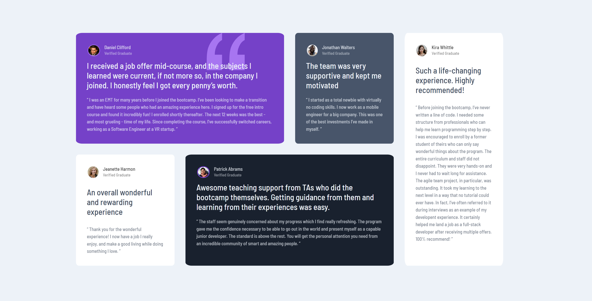
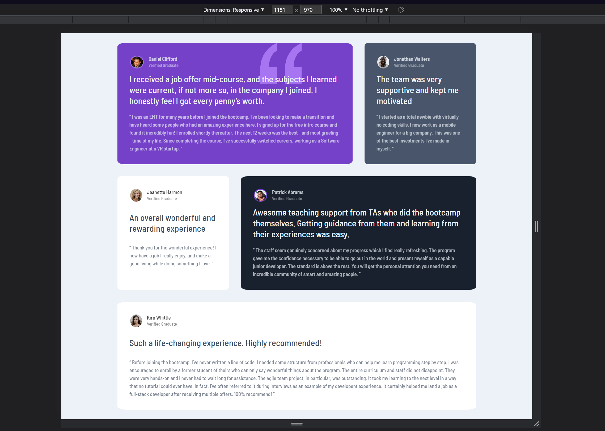
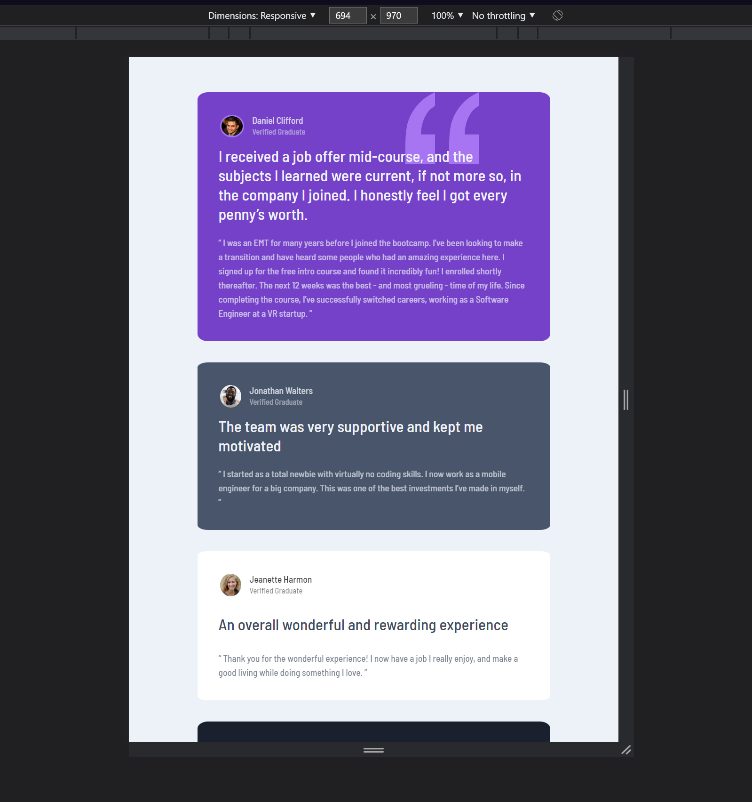
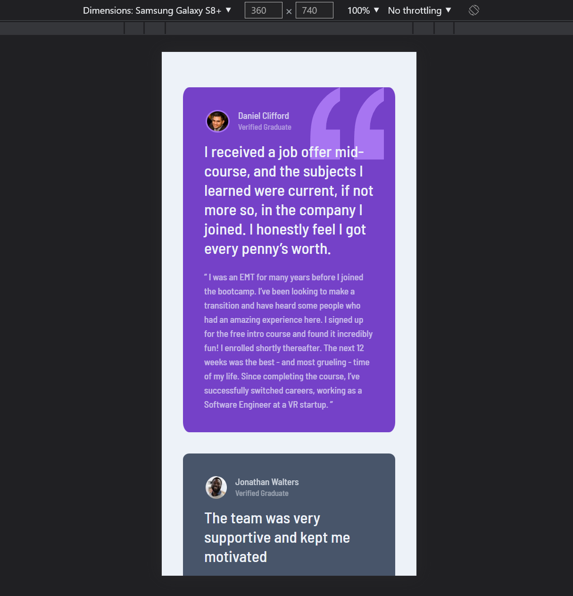

# Frontend Mentor - Testimonials grid section

---

**Welcome** to my second project with pure html and css. I am glad to see you here because I tried so hard to make this project as best as I can. I will appreciate if you take a look to the code and say where something is wrong with it. I made responsiveness for phones, desktops (its looks the same how preview design) and I transformed it a little for tablet devices. In my opinion now its looking better.

I must admit that **I had a little problem** with grid when I tried make layout for smallest devices. I think I shouldnt used pixels for comment-cards but when I realized that it was to late. In that case Ive just used flexbox for rescue that situation. I dunno how its work, but exactly this is work really good, I guess.

---

## My design

- Desktop

- Tablet/biggest mobile devices itp

- Smartphones

